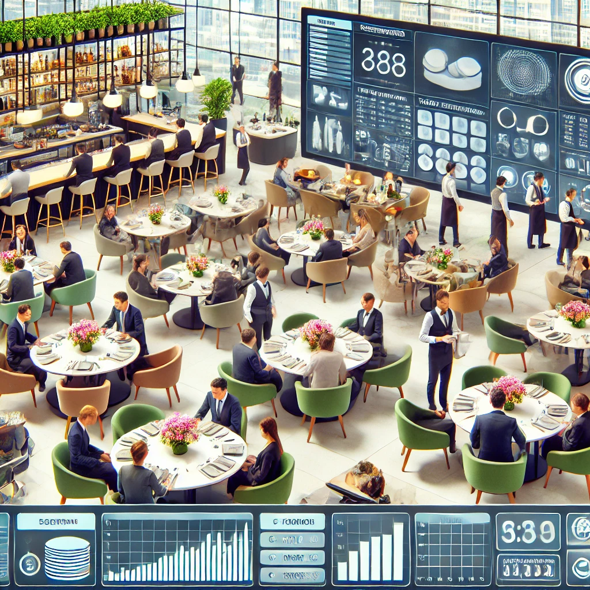

# pyRestaurante

- [Enunciado](enunciado.md)

## Soluciones y aproximaciones a las mismas

|Asignatura|Versión / Artefacto(s)|
|-|:-:|
PRG1|vPRG1
PRG2|vPRG2
EDA1|vEDA1
EDA2|vEDA2
IdSw1|MdD / DdR
IdSw2|D / dM / dOO