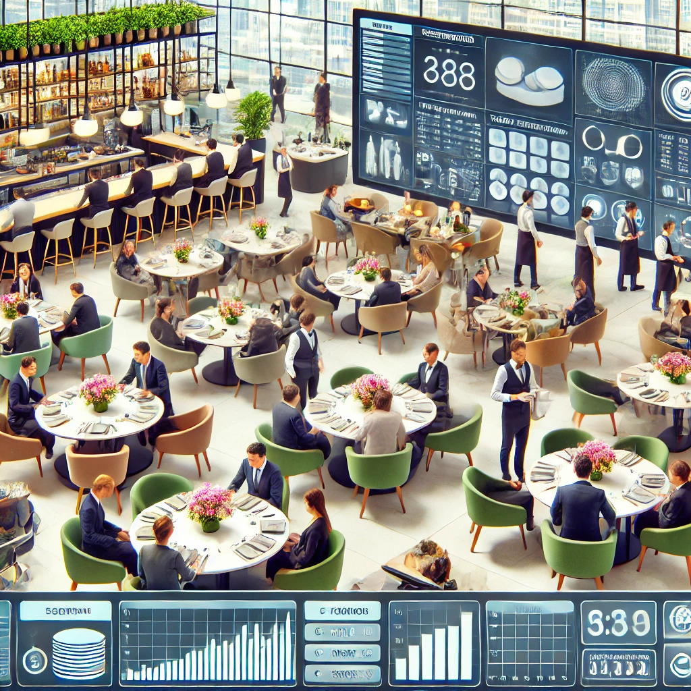

# pyRestaurante

Un restaurante de alta cocina necesita un sistema para gestionar sus reservas, mesas, pedidos y personal. El restaurante cuenta con diferentes tipos de mesas (para 2, 4, 6 y 8 personas), zonas (terraza, salón principal, salón privado), y turnos de comida (almuerzo: 13:00-16:00, cena: 20:00-23:00).

El sistema debe optimizar la asignación de mesas, gestionar los tiempos de los platos y coordinar el trabajo entre cocina y sala para maximizar la eficiencia y satisfacción de los clientes.

## Requisitos básicos

1. Implemente un sistema de gestión de mesas que:
   - Registre las características de cada mesa: número, capacidad, ubicación.
   - Controle el estado de cada mesa (libre, reservada, ocupada, en preparación para próximos clientes).
   - Gestione los tiempos promedio de ocupación según la capacidad de la mesa:
     - Mesa para 2: 60-90 minutos.
     - Mesa para 4: 90-120 minutos.
     - Mesa para 6 o más: 120-150 minutos.
2. Desarrolle un sistema de reservas que:
   - Permita registrar reservas con datos del cliente, fecha, hora, número de comensales y preferencias.
   - Verifique la disponibilidad real según la ocupación prevista.
   - Gestione una lista de espera cuando no haya disponibilidad.
   - Envíe recordatorios automáticos 24 horas antes de la reserva.
3. Implemente un sistema de gestión de pedidos:
   - Cada pedido estará vinculado a una mesa.
   - Contendrá los platos solicitados por cada comensal.
   - Registrará los tiempos de pedido, preparación y servicio.
   - Calculará el importe total y el desglose por comensal si se solicita.
4. Configure un sistema de personal que:
   - Gestione diferentes roles: camareros, ayudantes, sumiller, chef, ayudantes de cocina.
   - Asigne responsabilidades sobre mesas o zonas.
   - Registre horarios de trabajo y descansos.
   - Calcule la carga de trabajo por empleado.

## Retos extendidos

1. Implemente un sistema de asignación inteligente de mesas que:
   - Optimice la distribución según el número de comensales y la duración prevista.
   - Respete preferencias del cliente cuando sea posible (zona, mesa específica).
   - Evite tener mesas grandes ocupadas por grupos pequeños en horas punta.
   - Coloque estratégicamente a los clientes para equilibrar la carga de los camareros.
2. Desarrolle un sistema de gestión de la cocina:
   - Organice la preparación de platos por estaciones (entrantes, principales, postres).
   - Coordine los tiempos para que los platos salgan sincronizados.
   - Gestione ingredientes y avise cuando algo se agote.
   - Calcule tiempos de espera para informar a los clientes.
3. Añada un sistema de fidelización que:
   - Registre historial de visitas y preferencias de clientes habituales.
   - Ofrezca beneficios según frecuencia de visitas (copa de bienvenida, postre gratuito).
   - Permita dar prioridad en lista de espera a clientes frecuentes.
   - Identifique y gestione fechas especiales (cumpleaños, aniversarios).

## Escenarios avanzados

1. Implemente la gestión de eventos especiales:
   - Reserva de espacios completos para grupos.
   - Menús especiales preacordados.
   - Personal exclusivo para el evento.
   - Facturación especial para empresas.
2. Desarrolle un sistema de predicción basado en históricos:
   - Anticipe días u horas de mayor ocupación.
   - Estime necesidades de personal según la ocupación prevista.
   - Sugiera aprovisionamiento de ingredientes según tendencias.
   - Identifique patrones de cancelación y sobrerreserva.
3. Añada un sistema de gestión de incidencias:
   - Registre problemas en servicio, cocina o con clientes.
   - Implemente protocolos de resolución según tipo de incidencia.
   - Establezca compensaciones automáticas según gravedad.
   - Analice patrones para prevención.
4. Implementar un sistema de control de inventario:
   - Gestione bodega de vinos con temperatura y años.
   - Controle ingredientes frescos y fecha de caducidad.
   - Actualice inventario automáticamente al confirmar pedidos.
   - Genere alertas de reposición basadas en consumo y previsiones.

## Visualización del sistema

El sistema debe permitir visualizar en tiempo real:

```
DASHBOARD RESTAURANTE GOURMET - FECHA: 15/06/2025
--------------------------------------------------
ESTADO ACTUAL: 20:45 - TURNO CENA
Ocupación: 85% (17/20 mesas)
Próximas llegadas: 2 (21:00), 1 (21:15)
Lista de espera: 3 grupos

DISTRIBUCIÓN DE MESAS:
[T1-2:🟢] [T2-2:🔴] [T3-4:🔴] [T4-4:🔴] [T5-6:🔴]
[T6-2:🔴] [T7-2:🟢] [T8-4:🔴] [T9-8:🔴] [T10-4:🔴]
[P1-2:🔴] [P2-2:🔴] [P3-4:🟡] [P4-4:🔴] [P5-6:🔴]
[Z1-2:🔵] [Z2-2:🔴] [Z3-4:🔴] [Z4-4:🔴] [Z5-8:🔴]

LEYENDA: 🟢Libre 🟡Reservada 🔴Ocupada 🔵En preparación

TIEMPOS CRÍTICOS:
• Mesa T3: 90min (riesgo de retraso)
• Mesa P5: 110min (20min sobre tiempo esperado)

ESTADO COCINA:
Entrantes: 4 pendientes, 3 en preparación
Principales: 8 pendientes, 5 en preparación
Postres: 2 en preparación
Personal: Chef(🔴), Ayudante1(🔴), Ayudante2(🟢)

PRÓXIMAS RESERVAS:
21:00 - García (4pax) - Mesa P3
21:00 - Martínez (6pax) - Mesa T5
21:15 - Rodríguez (2pax) - Mesa Z1
--------------------------------------------------
```
